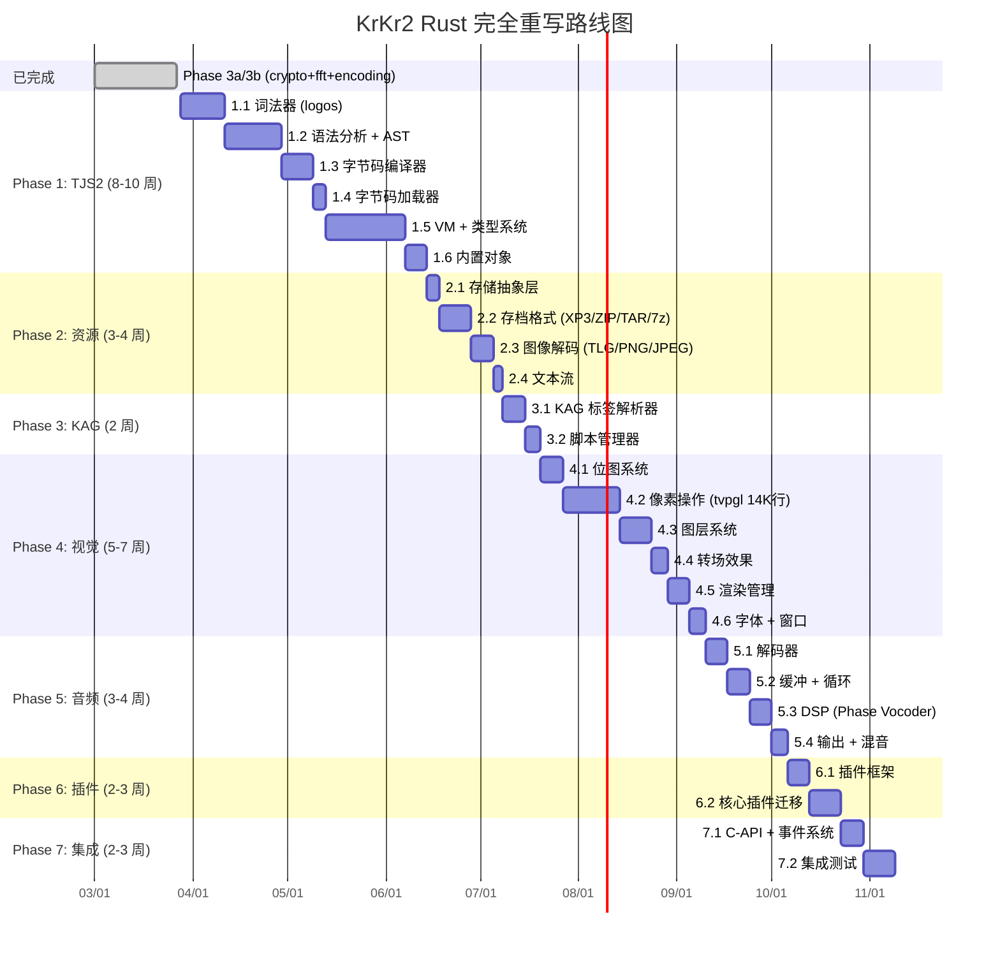
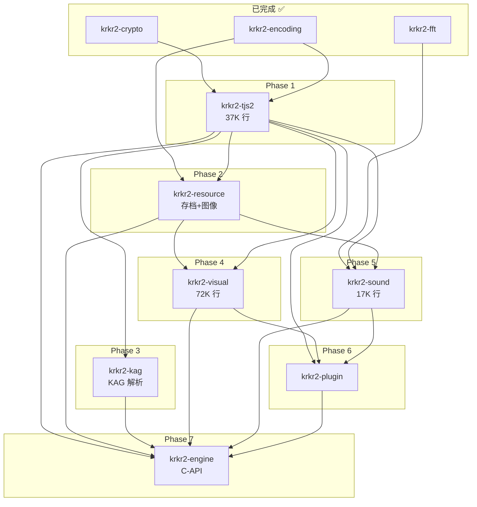

# KrKr2 引擎后端 Rust 完全重写计划 (Phase 3)

## 背景

将 `backend/core/` 下 **~133K 行** C++ 引擎代码完全用 Rust 重写，形成独立的 Rust 引擎库，通过 C-API 暴露给 Flutter/Dart FFI。

> [!IMPORTANT]
> **渐进式重写**：每个 Phase 结束时都有可独立编译验证的产出。旧 C++ 代码在对应 Phase 完成前继续使用。

### 已完成工作 (Phase 3a/3b)

| Crate | 替换的 C++ 文件 | 说明 |
|-------|----------------|------|
| `krkr2-crypto` | `md5.c`, `Random.cpp` | MD5 + PRNG |
| `krkr2-fft` | `RealFFT_Default.cpp` | Ooura FFT |
| `krkr2-encoding` | `CharacterSet.cpp`, `gbk2unicode.c`, `jis2unicode.c` | ~889KB 查表代码被 `encoding_rs` 替代 |

---

## 代码量分析

| 模块 | 目录 | C++ 行数 | 核心职责 | 重写优先级 |
|------|------|---------|---------|-----------|
| TJS2 脚本引擎 | `tjs2/` | **37,180** | 词法/语法/编译/VM/类型系统/GC | **P0** |
| 视觉/渲染 | `visual/` | **71,807** | 图层树/位图/像素操作/转场/图像加载 | P2 |
| 插件系统 | `plugins/` | **27,895** | KAG 解析/xp3filter/窗口扩展/CSV/JSON等 | P1-P3 |
| 基础设施 | `base/` | **18,240** | 存档(XP3/ZIP/TAR/7z)/事件/脚本管理/存储/文本流 | P1 |
| 音频 | `sound/` | **17,454** | 音频管线/DSP/解码/环形缓冲 | P2 |
| 工具 | `utils/` | **6,537** | 调试/剪贴板/定时器/速度追踪 (部分已完成) | ✅/P3 |
| 视频 | `movie/ffmpeg/` | **21,431** | FFmpeg 视频播放器 | P3 (FFI封装) |
| 环境/应用 | `environ/` | **3,654** | Application/CPU检测/XP3打包 | P3 |
| 插件框架 | `plugin/` | **6,537** | ncbind 模板元编程/插件加载 | P3 |

**总计：~210K 行** (含 plugins)

---

## Rust Workspace 架构

```
backend/rust/
├── Cargo.toml                    # workspace root
├── krkr2-engine/                 # Phase 7: 顶层引擎入口 + C-API
│   └── src/lib.rs
├── krkr2-tjs2/                   # Phase 1: TJS2 脚本引擎 (37K 行)
│   ├── src/
│   │   ├── lib.rs
│   │   ├── lexer.rs              # 词法分析 (logos crate)
│   │   ├── token.rs              # Token 类型定义
│   │   ├── parser.rs             # 手写递归下降 parser
│   │   ├── ast.rs                # AST 节点 (enum)
│   │   ├── compiler.rs           # AST → 字节码
│   │   ├── bytecode.rs           # 字节码指令集定义
│   │   ├── bytecode_loader.rs    # .tjs 字节码二进制加载
│   │   ├── vm.rs                 # 虚拟机求值循环
│   │   ├── variant.rs            # tTJSVariant 动态类型
│   │   ├── string.rs             # ttstr (Arc<str> 内部化)
│   │   ├── object.rs             # iTJSDispatch2 → trait TjsDispatch
│   │   ├── dict.rs               # Dictionary
│   │   ├── array.rs              # Array
│   │   ├── regexp.rs             # 正则 (regex crate)
│   │   ├── math.rs               # Math 内置对象
│   │   ├── date.rs               # Date 内置对象
│   │   ├── octet.rs              # Octet (二进制序列) 处理
│   │   ├── serializer.rs         # 二进制序列化/反序列化
│   │   ├── debug.rs              # 调试/反汇编
│   │   └── error.rs              # 错误类型
│   └── tests/
│       ├── lexer_tests.rs
│       ├── parser_tests.rs
│       ├── vm_tests.rs
│       └── compat_tests.rs       # C++ 行为一致性对比
│
├── krkr2-resource/               # Phase 2: 资源系统 (含存档+图像)
│   ├── src/
│   │   ├── lib.rs
│   │   ├── storage.rs            # 统一资源 trait
│   │   ├── xp3/                  # XP3 存档解析
│   │   │   ├── mod.rs
│   │   │   ├── archive.rs        # XP3 格式解析
│   │   │   └── filter.rs         # xp3filter 解密
│   │   ├── zip.rs                # ZIP (zip crate)
│   │   ├── tar.rs                # TAR (tar crate)
│   │   ├── sevenz.rs             # 7z (sevenz-rust)
│   │   ├── image/                # 图像解码
│   │   │   ├── mod.rs
│   │   │   ├── tlg.rs            # TLG5/TLG6 自研格式
│   │   │   ├── png.rs            # PNG (png crate)
│   │   │   ├── jpeg.rs           # JPEG (jpeg-decoder)
│   │   │   └── webp.rs           # WebP (webp crate)
│   │   ├── text_stream.rs        # 文本流 + BOM检测
│   │   └── binary_stream.rs      # 二进制流
│   └── tests/
│
├── krkr2-kag/                    # Phase 3: KAG 解析器
│   ├── src/
│   │   ├── lib.rs
│   │   ├── parser.rs             # KAG 标签语法解析
│   │   ├── tag.rs                # Tag/Macro 数据结构
│   │   └── scenario.rs           # 场景缓存/管理
│   └── tests/
│
├── krkr2-visual/                 # Phase 4: 视觉系统 (72K 行)
│   ├── src/
│   │   ├── lib.rs
│   │   ├── bitmap.rs             # 32bpp RGBA 位图
│   │   ├── layer.rs              # 图层树：可见性/位置/混合模式
│   │   ├── layer_manager.rs      # 图层管理器
│   │   ├── pixel_ops.rs          # tvpgl 像素操作 (AlphaBlend 等)
│   │   ├── pixel_ops_simd.rs     # SIMD 优化版 (后期)
│   │   ├── transition.rs         # 转场效果
│   │   ├── render.rs             # 脏矩形合成器
│   │   ├── font.rs               # FreeType 字体渲染
│   │   ├── complex_rect.rs       # 复杂区域运算
│   │   ├── window.rs             # 窗口 trait
│   │   ├── menu.rs               # 菜单系统
│   │   └── video_overlay.rs      # 视频叠加
│   └── tests/
│
├── krkr2-sound/                  # Phase 5: 音频系统 (17K 行)
│   ├── src/
│   │   ├── lib.rs
│   │   ├── decoder.rs            # trait WaveDecoder
│   │   ├── vorbis.rs             # Vorbis 解码
│   │   ├── ff_decoder.rs         # FFmpeg 解码封装
│   │   ├── buffer.rs             # 环形缓冲 (lock-free)
│   │   ├── loop_mgr.rs           # 无缝循环/交叉淡入淡出
│   │   ├── vocoder.rs            # Phase Vocoder 变速不变调
│   │   ├── mixer.rs              # 多轨混音
│   │   ├── format_conv.rs        # 格式转换
│   │   └── output.rs             # 平台音频输出 trait
│   └── tests/
│
├── krkr2-plugin/                 # Phase 6: 插件框架
│   ├── src/
│   │   ├── lib.rs
│   │   ├── registry.rs           # 插件注册
│   │   └── bridge.rs             # TJS2 ↔ 原生插件桥接
│   └── tests/
│
├── krkr2-crypto/                 # ✅ 已完成
├── krkr2-fft/                    # ✅ 已完成
└── krkr2-encoding/               # ✅ 已完成
```

---

## Phase 1: TJS2 脚本引擎 (8-10 周)

> [!CAUTION]
> 这是整个重写的**关键路径**。TJS2 是所有模块的核心依赖，37K 行 C++ 代码涉及词法/语法/编译/VM/类型系统/GC。

### 1.1 词法器 `lexer.rs` + `token.rs` (1-2 周)

**替代**：[tjsLex.cpp](file:///Users/yorkyang2333/Documents/KrKr2-Revived/backend/core/tjs2/tjsLex.cpp) (1895 行) + bison 文法 [tjs.y](file:///Users/yorkyang2333/Documents/KrKr2-Revived/backend/core/tjs2/bison/tjs.y) 中的 token 定义

| 特性 | 实现方式 |
|------|---------|
| Token 类型 | 使用 `logos` crate 声明式定义 |
| 关键字 | `if`, `else`, `for`, `while`, `do`, `switch`, `case`, `default`, `break`, `continue`, `return`, `try`, `catch`, `throw`, `class`, `extends`, `new`, `delete`, `typeof`, `instanceof`, `in`, `var`, `const`, `function`, `property`, `setter`, `getter`, `with`, `super`, `this`, `global`, `void`, `int`, `real`, `string`, `octet`, `incontextof`, `invalidate`, `isvalid`, `synchronized` |
| 字符串字面量 | 单引号/双引号，支持 `\n`, `\t`, `\x`, `\u` 转义 + `&` 内嵌表达式 |
| 正则表达式字面量 | `/pattern/flags` (区分除法运算符需上下文) |
| Octet 字面量 | `<% hex_data %>` |
| 数字 | 整数/浮点/0x十六进制/0o八进制/0b二进制 |

### 1.2 语法分析器 `parser.rs` + `ast.rs` (2-3 周)

**替代**：[tjsInterCodeGen.cpp](file:///Users/yorkyang2333/Documents/KrKr2-Revived/backend/core/tjs2/tjsInterCodeGen.cpp) (4120 行解析部分) + [tjs.y](file:///Users/yorkyang2333/Documents/KrKr2-Revived/backend/core/tjs2/bison/tjs.y)

- **手写递归下降 parser**（TJS2 文法不规则，有 `incontextof`/`invalidate` 等特殊语义，lalrpop 适配性差）
- `ast.rs` 用 Rust enum 表示 ~30+ AST 节点变体

```rust
enum Expr {
    IntLit(i64), RealLit(f64), StringLit(String), OctetLit(Vec<u8>),
    Binary { op: BinOp, lhs: Box<Expr>, rhs: Box<Expr> },
    Unary { op: UnaryOp, operand: Box<Expr> },
    Conditional { cond: Box<Expr>, then: Box<Expr>, else_: Box<Expr> },
    FuncCall { callee: Box<Expr>, args: Vec<Expr> },
    PropAccess { object: Box<Expr>, name: String },
    IndexAccess { object: Box<Expr>, index: Box<Expr> },
    Assign { target: Box<Expr>, op: AssignOp, value: Box<Expr> },
    FuncExpr { name: Option<String>, params: Vec<Param>, body: Vec<Stmt> },
    DictLit(Vec<(Expr, Expr)>),
    ArrayLit(Vec<Expr>),
    RegExpLit { pattern: String, flags: String },
    InContextOf { expr: Box<Expr>, context: Box<Expr> },
    TypeOf(Box<Expr>), InstanceOf { expr: Box<Expr>, ty: Box<Expr> },
    // ...
}

enum Stmt {
    Var(Vec<VarDecl>), ExprStmt(Expr),
    If { cond: Expr, then: Box<Stmt>, else_: Option<Box<Stmt>> },
    While { cond: Expr, body: Box<Stmt> }, DoWhile { body: Box<Stmt>, cond: Expr },
    For { init: Option<Box<Stmt>>, cond: Option<Expr>, update: Option<Expr>, body: Box<Stmt> },
    Switch { expr: Expr, cases: Vec<SwitchCase> },
    TryCatch { try_body: Vec<Stmt>, catch_name: Option<String>, catch_body: Vec<Stmt> },
    Return(Option<Expr>), Throw(Expr), Break, Continue,
    With { object: Expr, body: Box<Stmt> },
    ClassDecl { name: String, extends: Option<String>, body: Vec<ClassMember> },
    Block(Vec<Stmt>),
    // ...
}
```

### 1.3 字节码编译器 `compiler.rs` + `bytecode.rs` (1-2 周)

**替代**：[tjsInterCodeGen.cpp](file:///Users/yorkyang2333/Documents/KrKr2-Revived/backend/core/tjs2/tjsInterCodeGen.cpp) 代码生成部分 + 相关指令定义

| 功能 | 说明 |
|------|------|
| 指令集 | 参考原 C++ `VMCodes` 定义，Rust enum `OpCode` |
| 常量池 | `Vec<TjsVariant>` 存储字符串/数字常量 |
| 寄存器分配 | TJS2 使用基于寄存器的 VM，需维护 register frame |
| 闭包 | 变量捕获列表 + upvalue 处理 |
| 异常表 | try-catch 块的 PC 范围映射 |

### 1.4 字节码加载器 `bytecode_loader.rs` (0.5 周)

**替代**：[tjsByteCodeLoader.cpp](file:///Users/yorkyang2333/Documents/KrKr2-Revived/backend/core/tjs2/tjsByteCodeLoader.cpp) (28K)

- 加载预编译的 `.tjs` 字节码二进制格式
- 支持与 C++ 版相同的序列化格式以保持向后兼容

### 1.5 虚拟机 `vm.rs` + 类型系统 `variant.rs` + `object.rs` (3-4 周)

**替代**：
- [tjsInterCodeExec.cpp](file:///Users/yorkyang2333/Documents/KrKr2-Revived/backend/core/tjs2/tjsInterCodeExec.cpp) (126K bytes, ~3100 行) — VM 求值循环
- [tjsVariant.cpp](file:///Users/yorkyang2333/Documents/KrKr2-Revived/backend/core/tjs2/tjsVariant.cpp) + [.h](file:///Users/yorkyang2333/Documents/KrKr2-Revived/backend/core/tjs2/tjsVariant.h) (85K bytes)
- [tjsObject.cpp](file:///Users/yorkyang2333/Documents/KrKr2-Revived/backend/core/tjs2/tjsObject.cpp) (72K bytes)
- [tjsString.cpp](file:///Users/yorkyang2333/Documents/KrKr2-Revived/backend/core/tjs2/tjsString.cpp) + `.h` (26K bytes)

**核心类型设计**：

```rust
// variant.rs — TJS2 动态类型
enum TjsVariant {
    Void,
    Int(i64),
    Real(f64),
    String(TjsString),       // Arc<str> + 内部化缓存
    Octet(Arc<[u8]>),
    Object(TjsObjectRef),    // Arc<dyn TjsDispatch>
}

// object.rs — 对象接口（替代 iTJSDispatch2 的 30+ 虚函数）
trait TjsDispatch: Send + Sync {
    fn prop_get(&self, name: &str, objthis: Option<&TjsObjectRef>) -> Result<TjsVariant>;
    fn prop_set(&mut self, name: &str, value: TjsVariant, objthis: Option<&TjsObjectRef>) -> Result<()>;
    fn func_call(&self, args: &[TjsVariant], objthis: Option<&TjsObjectRef>) -> Result<TjsVariant>;
    fn create_new(&self, args: &[TjsVariant]) -> Result<TjsObjectRef>;
    fn prop_get_by_num(&self, num: i32, objthis: Option<&TjsObjectRef>) -> Result<TjsVariant>;
    fn prop_set_by_num(&mut self, num: i32, value: TjsVariant, objthis: Option<&TjsObjectRef>) -> Result<()>;
    fn delete_member(&mut self, name: &str) -> Result<bool>;
    fn invalidate(&mut self) -> Result<()>;
    fn is_valid(&self) -> bool;
    fn get_count(&self) -> Result<usize>;
    fn enum_members(&self, callback: &mut dyn FnMut(&str, &TjsVariant) -> bool) -> Result<()>;
    fn class_instance_info(&self) -> Option<&str>;
    // ...
}
```

- **内存管理**：`Arc` + `Weak` 引用计数，周期性循环引用检测扫描
- **内置对象**：`Array`, `Dictionary`, `RegExp`, `Math`, `Date`, `Exception`, `RandomGenerator`

### 1.6 内置对象和辅助模块 (1 周)

| C++ 文件 | Rust 模块 | 说明 |
|----------|----------|------|
| [tjsArray.cpp](file:///Users/yorkyang2333/Documents/KrKr2-Revived/backend/core/tjs2/tjsArray.cpp) (70K) | `array.rs` | Array 对象 + 排序/查找 |
| [tjsDictionary.cpp](file:///Users/yorkyang2333/Documents/KrKr2-Revived/backend/core/tjs2/tjsDictionary.cpp) (32K) | `dict.rs` | Dictionary 对象 |
| [tjsRegExp.cpp](file:///Users/yorkyang2333/Documents/KrKr2-Revived/backend/core/tjs2/tjsRegExp.cpp) (26K) | `regexp.rs` | 正则 → `regex` crate |
| [tjsMath.cpp](file:///Users/yorkyang2333/Documents/KrKr2-Revived/backend/core/tjs2/tjsMath.cpp) (16K) | `math.rs` | Math 对象 |
| [tjsDate.cpp](file:///Users/yorkyang2333/Documents/KrKr2-Revived/backend/core/tjs2/tjsDate.cpp) (12K) | `date.rs` | Date 对象 + 日期解析 |
| [tjsOctPack.cpp](file:///Users/yorkyang2333/Documents/KrKr2-Revived/backend/core/tjs2/tjsOctPack.cpp) (45K) | `octet.rs` | Octet pack/unpack |
| [tjsBinarySerializer.cpp](file:///Users/yorkyang2333/Documents/KrKr2-Revived/backend/core/tjs2/tjsBinarySerializer.cpp) (17K) | `serializer.rs` | 二进制序列化 |
| [tjsRandomGenerator.cpp](file:///Users/yorkyang2333/Documents/KrKr2-Revived/backend/core/tjs2/tjsRandomGenerator.cpp) (13K) | 复用 `krkr2-crypto` | MT19937 |
| [tjsDisassemble.cpp](file:///Users/yorkyang2333/Documents/KrKr2-Revived/backend/core/tjs2/tjsDisassemble.cpp) (29K) | `debug.rs` | 反汇编器 |
| [tjsScriptBlock.cpp](file:///Users/yorkyang2333/Documents/KrKr2-Revived/backend/core/tjs2/tjsScriptBlock.cpp) (34K) | `script_block.rs` | 脚本块管理 |
| [tjsScriptCache.cpp](file:///Users/yorkyang2333/Documents/KrKr2-Revived/backend/core/tjs2/tjsScriptCache.cpp) (7K) | `script_cache.rs` | 编译缓存 |

### 1.7 验证里程碑

```bash
# 最小可行验证：能从源码编译并执行 TJS2 脚本
cargo run -p krkr2-tjs2 --bin tjs2-cli -- test.tjs

# 字节码加载验证：能加载 C++ 版编译的 .tjs 二进制
cargo run -p krkr2-tjs2 --bin tjs2-cli -- --bytecode game.tjs.bin
```

---

## Phase 2: 资源系统 (3-4 周)

**替代**：`base/` 下存档和存储相关文件 + `visual/` 下图像加载文件

### 2.1 存储抽象层 `storage.rs` (0.5 周)

**替代**：[StorageIntf.cpp](file:///Users/yorkyang2333/Documents/KrKr2-Revived/backend/core/base/StorageIntf.cpp) (45K) + [UtilStreams.cpp](file:///Users/yorkyang2333/Documents/KrKr2-Revived/backend/core/base/UtilStreams.cpp) (30K) + [BinaryStream.cpp](file:///Users/yorkyang2333/Documents/KrKr2-Revived/backend/core/base/BinaryStream.cpp)

```rust
trait ResourceProvider: Send + Sync {
    fn open(&self, path: &str) -> Result<Box<dyn ReadSeek>>;
    fn exists(&self, path: &str) -> bool;
    fn list(&self, prefix: &str) -> Vec<String>;
}

struct LayeredStorage {
    providers: Vec<Box<dyn ResourceProvider>>,  // file > xp3 > zip 优先级
}
```

### 2.2 存档格式 (1-2 周)

| C++ 文件 | Rust 实现 | 依赖 |
|----------|----------|------|
| [XP3Archive.cpp](file:///Users/yorkyang2333/Documents/KrKr2-Revived/backend/core/base/XP3Archive.cpp) (37K) | `xp3/archive.rs` 手写解析 | `flate2` |
| [xp3filter.cpp](file:///Users/yorkyang2333/Documents/KrKr2-Revived/backend/plugins/xp3filter.cpp) (19K) | `xp3/filter.rs` | 纯位操作 |
| [ZIPArchive.cpp](file:///Users/yorkyang2333/Documents/KrKr2-Revived/backend/core/base/ZIPArchive.cpp) (8.7K) | `zip.rs` | `zip` crate |
| [TARArchive.cpp](file:///Users/yorkyang2333/Documents/KrKr2-Revived/backend/core/base/TARArchive.cpp) (5.5K) | `tar.rs` | `tar` crate |
| [7zArchive.cpp](file:///Users/yorkyang2333/Documents/KrKr2-Revived/backend/core/base/7zArchive.cpp) (9K) | `sevenz.rs` | `sevenz-rust` |

### 2.3 图像解码 (1 周)

| C++ 文件 | Rust 实现 | 依赖 |
|----------|----------|------|
| [LoadTLG.cpp](file:///Users/yorkyang2333/Documents/KrKr2-Revived/backend/core/visual/LoadTLG.cpp) (26K) | `image/tlg.rs` **手写** | LZSS/Golomb 纯算法 |
| [LoadPNG.cpp](file:///Users/yorkyang2333/Documents/KrKr2-Revived/backend/core/visual/LoadPNG.cpp) (28K) | `image/png.rs` | `png` crate |
| [LoadJPEG.cpp](file:///Users/yorkyang2333/Documents/KrKr2-Revived/backend/core/visual/LoadJPEG.cpp) (24K) | `image/jpeg.rs` | `jpeg-decoder` |
| [LoadWEBP.cpp](file:///Users/yorkyang2333/Documents/KrKr2-Revived/backend/core/visual/LoadWEBP.cpp) (4K) | `image/webp.rs` | `webp` crate |
| [LoadBPG.cpp](file:///Users/yorkyang2333/Documents/KrKr2-Revived/backend/core/visual/LoadBPG.cpp) (2.4K) | 保持 FFI | 无纯 Rust BPG 解码器 |

### 2.4 文本流 (0.5 周)

**替代**：[TextStream.cpp](file:///Users/yorkyang2333/Documents/KrKr2-Revived/backend/core/base/TextStream.cpp) (16K)

- UTF-8/UTF-16 BOM 自动检测
- 复用 `krkr2-encoding` crate

### 2.5 验证里程碑

```bash
# XP3 存档能正确列出文件列表并提取文件
cargo test -p krkr2-resource -- xp3

# 真实 .xp3 文件解压 → 与 C++ 版逐字节对比
cargo run -p krkr2-resource --bin xp3-extract -- game.xp3 ./output/

# TLG 图像解码 → 逐像素对比 C++ 版输出
cargo test -p krkr2-resource -- tlg_decode
```

---

## Phase 3: KAG 解析器 + 脚本胶合层 (2 周)

**替代**：[KAGParser.cpp](file:///Users/yorkyang2333/Documents/KrKr2-Revived/backend/core/base/KAGParser.cpp) (95K bytes) + [ScriptMgnIntf.cpp](file:///Users/yorkyang2333/Documents/KrKr2-Revived/backend/core/base/ScriptMgnIntf.cpp) (55K)

### 3.1 KAG 标签解析器 (1 周)

```rust
// 数据结构
enum KagToken {
    Text(String),                                        // 普通文本
    Tag { name: String, attrs: HashMap<String, String> }, // [tagname attr=value]
    Label(String),                                        // *label_name
    LineBreak,                                            // [l] / [r]
    PageBreak,                                            // [p]
}

struct KagParser {
    scenario: Arc<ScenarioCache>,
    position: KagPosition,
    macros: HashMap<String, MacroDef>,
    call_stack: Vec<CallFrame>,
    cond_stack: Vec<bool>,   // [if]/[endif] 嵌套
}
```

- 使用 `nom` 或手写解析 `[tag attr="val"]` 语法
- 宏展开 `[macro name=xxx]...[endmacro]`
- 条件分支 `[if exp=...]...[elsif]...[else]...[endif]`
- 与 TJS2 集成：`[iscript]...[endscript]` 和 `[eval exp="..."]`

### 3.2 脚本管理器 (1 周)

- 场景文件加载和缓存
- `[call]`/`[return]` 调用栈
- 存档/读档时的序列化/反序列化

---

## Phase 4: 视觉/渲染系统 (5-7 周)

> [!WARNING]
> 这是代码量最大的模块 (72K 行)。包含大量 SIMD 优化的像素操作。

**替代**：`visual/` 目录下全部核心文件

### 4.1 位图系统 `bitmap.rs` (1 周)

**替代**：[BitmapIntf.cpp](file:///Users/yorkyang2333/Documents/KrKr2-Revived/backend/core/visual/BitmapIntf.cpp) (22K) + [LayerBitmapIntf.cpp](file:///Users/yorkyang2333/Documents/KrKr2-Revived/backend/core/visual/LayerBitmapIntf.cpp) (149K)

```rust
struct Bitmap {
    width: u32,
    height: u32,
    data: Vec<u32>,  // ARGB 8888
    pitch: usize,
}

impl Bitmap {
    fn scanline(&self, y: u32) -> &[u32];
    fn scanline_mut(&mut self, y: u32) -> &mut [u32];
    fn blit(&mut self, src: &Bitmap, dx: i32, dy: i32, blend: BlendMode);
}
```

### 4.2 像素操作 `pixel_ops.rs` (2-3 周)

**替代**：[tvpgl.cpp](file:///Users/yorkyang2333/Documents/KrKr2-Revived/backend/core/visual/tvpgl.cpp) (**558K bytes**, 约 14K+ 行 像素混合函数)

- 先实现标量 Rust 版 (~50+ 混合函数)
- 关键函数：`AlphaBlend`, `AdditiveAlphaBlend`, `PsAlphaBlend`, `CopyColor`, `ConstAlphaBlend`, etc.
- 后续使用 `std::simd` (nightly) 或 `packed_simd2` 优化热点路径

### 4.3 图层系统 `layer.rs` + `layer_manager.rs` (1-2 周)

**替代**：[LayerIntf.cpp](file:///Users/yorkyang2333/Documents/KrKr2-Revived/backend/core/visual/LayerIntf.cpp) (418K bytes!) + [LayerManager.cpp](file:///Users/yorkyang2333/Documents/KrKr2-Revived/backend/core/visual/LayerManager.cpp) (38K)

- 图层树：父子关系、Z 序、可见性、不透明度
- 图层类型：普通/Alpha/Additive
- 事件分发：点击测试 (hit test)、焦点管理

### 4.4 转场效果 `transition.rs` (0.5-1 周)

**替代**：[TransIntf.cpp](file:///Users/yorkyang2333/Documents/KrKr2-Revived/backend/core/visual/TransIntf.cpp) (43K)

- 交叉淡入淡出 (cross-fade)
- 通用规则图像转场 (universal transition using rule images)

### 4.5 渲染管理 `render.rs` (1 周)

**替代**：[RenderManager.cpp](file:///Users/yorkyang2333/Documents/KrKr2-Revived/backend/core/visual/RenderManager.cpp) (196K bytes)

- 脏矩形收集和合并
- 图层合成：遍历图层树，混合输出最终帧
- 帧缓冲输出（供平台层使用）

### 4.6 字体渲染 `font.rs` (0.5 周)

**替代**：[FreeType.cpp](file:///Users/yorkyang2333/Documents/KrKr2-Revived/backend/core/visual/FreeType.cpp) (25K) + [CharacterData.cpp](file:///Users/yorkyang2333/Documents/KrKr2-Revived/backend/core/visual/CharacterData.cpp) (16K) + [FontImpl.cpp](file:///Users/yorkyang2333/Documents/KrKr2-Revived/backend/core/visual/FontImpl.cpp) (10K)

- 使用 `freetype-rs` crate 做字形渲染
- 字符缓存 (glyph cache)

### 4.7 窗口/视频叠加 (0.5 周)

**替代**：[WindowIntf.cpp](file:///Users/yorkyang2333/Documents/KrKr2-Revived/backend/core/visual/WindowIntf.cpp) (71K) + [VideoOvlIntf.cpp](file:///Users/yorkyang2333/Documents/KrKr2-Revived/backend/core/visual/VideoOvlIntf.cpp) (44K)

- 窗口 trait（平台层实现具体窗口系统）
- 视频叠加 trait（与 krkr2-sound/movie 模块交互）

---

## Phase 5: 音频系统 (3-4 周)

**替代**：`sound/` 目录全部文件

### 5.1 解码器 `decoder.rs` + 格式实现 (1 周)

| C++ 文件 | Rust 实现 | 依赖 |
|----------|----------|------|
| [VorbisWaveDecoder.cpp](file:///Users/yorkyang2333/Documents/KrKr2-Revived/backend/core/sound/VorbisWaveDecoder.cpp) (16K) | `vorbis.rs` | `symphonia` |
| [FFWaveDecoder.cpp](file:///Users/yorkyang2333/Documents/KrKr2-Revived/backend/core/sound/FFWaveDecoder.cpp) (14K) | `ff_decoder.rs` | `ffmpeg-sys` FFI |

```rust
trait WaveDecoder: Send {
    fn format(&self) -> WaveFormat;
    fn decode(&mut self, buf: &mut [f32]) -> Result<usize>;
    fn seek(&mut self, sample: u64) -> Result<()>;
    fn length_samples(&self) -> Option<u64>;
}
```

### 5.2 音频缓冲和循环管理 (1 周)

| C++ 文件 | Rust 实现 |
|----------|----------|
| [WaveSegmentQueue.cpp](file:///Users/yorkyang2333/Documents/KrKr2-Revived/backend/core/sound/WaveSegmentQueue.cpp) (9.4K) | `buffer.rs` |
| [RingBuffer.h](file:///Users/yorkyang2333/Documents/KrKr2-Revived/backend/core/sound/RingBuffer.h) (8.4K) | `buffer.rs` (lock-free ring buffer) |
| [WaveLoopManager.cpp](file:///Users/yorkyang2333/Documents/KrKr2-Revived/backend/core/sound/WaveLoopManager.cpp) (46K) | `loop_mgr.rs` |

### 5.3 DSP 处理 (1 周)

| C++ 文件 | Rust 实现 |
|----------|----------|
| [PhaseVocoderDSP.cpp](file:///Users/yorkyang2333/Documents/KrKr2-Revived/backend/core/sound/PhaseVocoderDSP.cpp) (36K) | `vocoder.rs` |
| [PhaseVocoderFilter.cpp](file:///Users/yorkyang2333/Documents/KrKr2-Revived/backend/core/sound/PhaseVocoderFilter.cpp) (14K) | `vocoder.rs` |
| [MathAlgorithms.cpp/h](file:///Users/yorkyang2333/Documents/KrKr2-Revived/backend/core/sound/MathAlgorithms.cpp) (25K ) | 复用 `krkr2-fft` + 新增 |

### 5.4 音频输出 + 混音 (0.5-1 周)

**替代**：[WaveIntf.cpp](file:///Users/yorkyang2333/Documents/KrKr2-Revived/backend/core/sound/WaveIntf.cpp) (65K)

- 使用 `cpal` 或 `miniaudio-rs` 跨平台音频后端
- 多轨混音器

---

## Phase 6: 插件框架 + 环境 (2-3 周)

### 6.1 插件系统重设计 (1 周)

**替代**：[ncbind.hpp](file:///Users/yorkyang2333/Documents/KrKr2-Revived/backend/core/plugin/ncbind.hpp) (93K 模板元编程) + [PluginImpl.cpp](file:///Users/yorkyang2333/Documents/KrKr2-Revived/backend/core/plugin/PluginImpl.cpp) (12K)

- 替换 C++ 模板元编程为 Rust proc-macro 或 trait-based 注册
- 插件 trait + 动态注册表

### 6.2 核心插件迁移 (1-2 周)

| 插件文件 | 代码量 | 说明 |
|---------|--------|------|
| [windowEx.cpp](file:///Users/yorkyang2333/Documents/KrKr2-Revived/backend/plugins/windowEx.cpp) | 57K | 窗口扩展功能 |
| [scriptsEx.cpp](file:///Users/yorkyang2333/Documents/KrKr2-Revived/backend/plugins/scriptsEx.cpp) | 34K | 脚本扩展 |
| [csvParser.cpp](file:///Users/yorkyang2333/Documents/KrKr2-Revived/backend/plugins/csvParser.cpp) | 13K | CSV 解析 |
| [saveStruct.cpp](file:///Users/yorkyang2333/Documents/KrKr2-Revived/backend/plugins/saveStruct.cpp) | 12K | 存档结构 |
| `json/` 子目录 | ~10K | JSON 处理 → `serde_json` |
| `psbfile/` 子目录 | ~15K | PSB 格式 |
| `psdfile/` 子目录 | ~10K | PSD 格式 |
| [layerExMovie.cpp](file:///Users/yorkyang2333/Documents/KrKr2-Revived/backend/plugins/layerExMovie.cpp) | 9.5K | 图层视频 |
| [layerExPerspective.cpp](file:///Users/yorkyang2333/Documents/KrKr2-Revived/backend/plugins/layerExPerspective.cpp) | 10K | 透视变换 |

### 6.3 环境/应用框架 (0.5 周)

**替代**：[Application.cpp](file:///Users/yorkyang2333/Documents/KrKr2-Revived/backend/core/environ/Application.cpp) (27K) + [DetectCPU.cpp](file:///Users/yorkyang2333/Documents/KrKr2-Revived/backend/core/environ/DetectCPU.cpp)

---

## Phase 7: 引擎入口 + C-API + 集成测试 (2-3 周)

### 7.1 `krkr2-engine` crate — C-API (1 周)

```rust
// C-API 暴露给 Flutter/Dart FFI
#[no_mangle]
pub extern "C" fn krkr2_engine_create(config: *const EngineConfig) -> *mut Engine { ... }

#[no_mangle]
pub extern "C" fn krkr2_engine_tick(engine: *mut Engine) -> i32 { ... }

#[no_mangle]
pub extern "C" fn krkr2_engine_render(
    engine: *mut Engine, buf: *mut u8, w: u32, h: u32
) { ... }

#[no_mangle]
pub extern "C" fn krkr2_engine_input(engine: *mut Engine, event: *const InputEvent) { ... }

#[no_mangle]
pub extern "C" fn krkr2_engine_destroy(engine: *mut Engine) { ... }
```

### 7.2 事件系统 (0.5 周)

**替代**：[EventIntf.cpp](file:///Users/yorkyang2333/Documents/KrKr2-Revived/backend/core/base/EventIntf.cpp) (41K)

- 异步事件队列
- 定时器事件
- 用户输入事件分发

### 7.3 集成测试 (1-2 周)

| 测试类别 | 对比方法 | 测试资源 |
|---------|---------|---------|
| TJS2 脚本兼容性 | 真实游戏 `.tjs` 脚本 → C++ vs Rust 输出对比 | `tests/test_files/` |
| KAG 场景解析 | `.ks` 场景文件解析结果对比 | 真实游戏 `.ks` |
| XP3 封包读取 | `.xp3` 解压内容逐字节对比 | 真实游戏 `.xp3` |
| TLG 图像解码 | TLG → RGBA 逐像素对比 | 测试 TLG 文件 |
| 音频播放 | PCM 输出对比 | WAV/OGG 测试文件 |

---

## 时间线总览



**预计总时长：~28-34 周（~7-8.5 个月）**

---

## 依赖关系图



---

## Rust 依赖清单

| Crate | 用途 | Phase |
|-------|------|-------|
| `logos` | 词法分析器生成 | 1 |
| `regex` | TJS2 RegExp 对象 | 1 |
| `chrono` | TJS2 Date 对象 | 1 |
| `flate2` | XP3 zlib 解压 | 2 |
| `zip` | ZIP 存档读取 | 2 |
| `tar` | TAR 存档读取 | 2 |
| `sevenz-rust` | 7z 存档读取 | 2 |
| `png` | PNG 解码 | 2 |
| `jpeg-decoder` | JPEG 解码 | 2 |
| `webp` | WebP 解码 | 2 |
| `nom` | KAG 标签解析 | 3 |
| `freetype-rs` | 字体渲染 | 4 |
| `packed_simd2` / `std::simd` | 像素操作 SIMD (可选) | 4 |
| `symphonia` | 音频解码 (Vorbis/Opus/等) | 5 |
| `cpal` 或 `miniaudio-rs` | 跨平台音频输出 | 5 |
| `serde` + `serde_json` | JSON 插件 / 配置 | 6 |
| `cbindgen` | C 头文件生成 | 7 |

---

## 风险与缓解措施

| 风险 | 影响 | 缓解措施 |
|------|------|---------|
| TJS2 兼容性不完整 | **致命** — 游戏脚本无法正确执行 | 大量参考原 C++ 实现，逐文件移植 + 真实游戏脚本回归测试 |
| tvpgl 像素操作性能 | **高** — 渲染帧率下降 | 先标量实现保证正确性；热点路径用 `std::simd` 逐步优化 |
| LayerIntf.cpp 体量巨大 (418K bytes) | **高** — 移植耗时超预期 | 按功能拆分为多个 Rust 模块，增量移植 |
| 过渡期引擎不可用 | **中** — 开发中断 | 保留 C++ 版可独立编译运行，Rust 版就绪后一次性切换 |
| FFmpeg 集成复杂 | **中** — 视频播放 | 保持 `ffmpeg-sys` FFI 封装，不重写 FFmpeg 代码 |
| 循环引用 GC | **中** — TJS2 对象泄漏 | `Arc`+`Weak` 基础引用计数 + 定期循环检测扫描 |
| BPG 格式无纯 Rust 解码器 | **低** — 罕见格式 | 保持 C FFI 封装 libbpg |

---

## User Review Required

> [!IMPORTANT]
> 以下决策需要确认：
> 1. **Phase 顺序**：TJS2 优先是否合理？或者先做资源系统更容易验证？
> 2. **视频播放**：`movie/ffmpeg/` (21K行) 保持 FFI 封装还是也要 Rust 重写？
> 3. **Live2D 插件**：`plugins/` 下是否包含需要迁移的 Live2D 相关代码？
> 4. **SIMD 优化**：tvpgl 的像素操作是否需要在初始版本就做 SIMD，还是先标量再优化？
> 5. **字节码格式兼容**：新 Rust VM 是否需要能加载 C++ 版编译的旧 .tjs 字节码？

## Verification Plan

### Automated Tests

每个 Phase 完成后都有对应的 `cargo test` 验证：

```bash
# Phase 1: TJS2
cargo test -p krkr2-tjs2                          # 全部单元测试
cargo run -p krkr2-tjs2 --bin tjs2-cli -- test.tjs # 脚本执行验证

# Phase 2: 资源
cargo test -p krkr2-resource                      # 存档+图像解码测试
cargo run -p krkr2-resource --bin xp3-extract -- game.xp3 ./out/  # 真实文件验证

# Phase 3: KAG
cargo test -p krkr2-kag                           # KAG 解析测试

# Phase 4-5: 视觉+音频
cargo test -p krkr2-visual                        # 像素操作正确性
cargo test -p krkr2-sound                         # 音频解码/DSP

# Phase 7: 集成
cargo test -p krkr2-engine                        # 端到端集成测试
```

### Manual Verification

- Phase 1 完成后: 用真实游戏 `.tjs` 脚本文件测试 VM，与 C++ 版对比输出
- Phase 2 完成后: 用真实 `.xp3` 游戏封包提取文件，与 C++ 版逐字节对比
- Phase 4 完成后: 用真实游戏素材渲染一帧画面，与 C++ 版逐像素对比截图
- Phase 7 完成后: 运行完整游戏流程，UI/音频/脚本全面回归测试

> [!TIP]
> 建议收集 3-5 款典型游戏的资源文件作为回归测试集，覆盖不同编码、压缩、和脚本复杂度。
